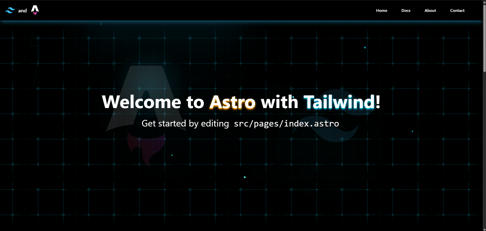
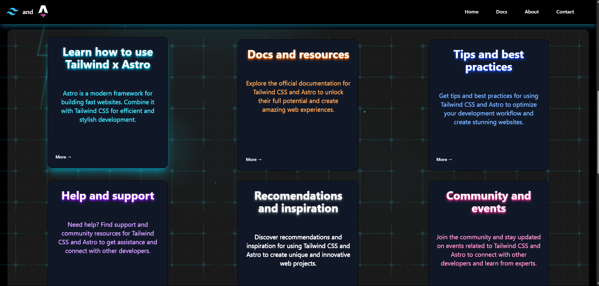
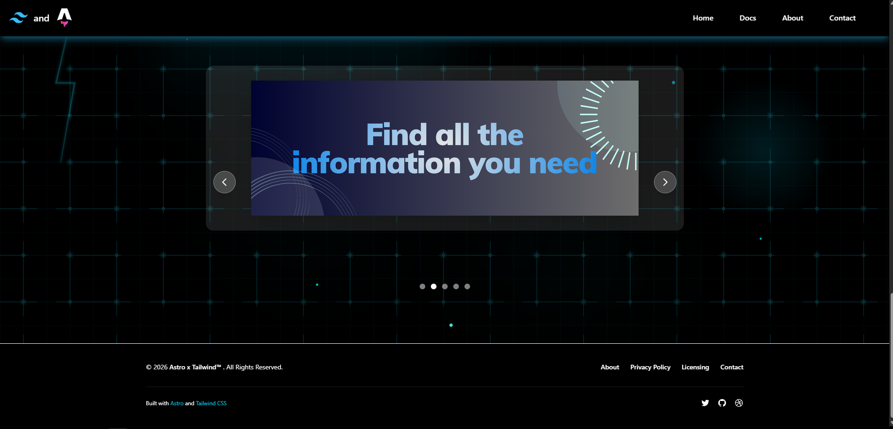
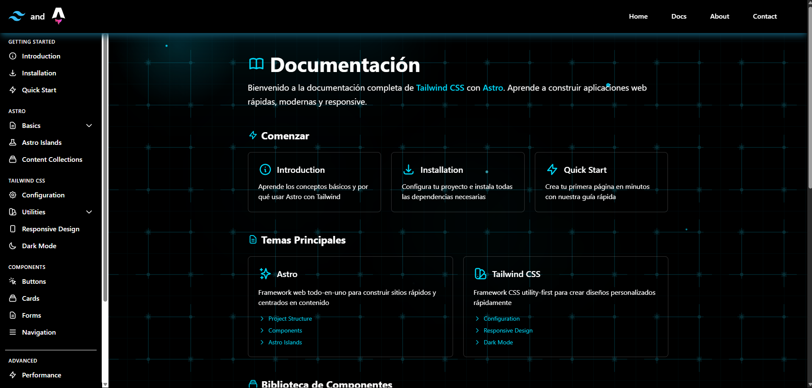

# Astro + Tailwind CSS

Proyecto iniciado con un enfoque práctico para aprender y dominar Tailwind CSS, construido sobre Astro. Aunque comenzó como un entorno de práctica, el proyecto está pensado para evolucionar progresivamente hacia una página informativa real, manteniendo buenas prácticas de estructura, rendimiento y diseño moderno.

## Tecnologías

* Astro
* Tailwind CSS
* HTML
* CSS
* JavaScript
* Flowbite

## Descripción

Este proyecto muestra una landing page simple con un diseño oscuro, tipografía clara y una estética tecnológica. Incluye una estructura básica de navegación, una sección principal de bienvenida y estilos reutilizables con Tailwind. Está pensado para experimentar, probar componentes y buenas prácticas.

## Estructura del proyecto

src/pages contiene las páginas principales del sitio.
src/components contiene los componentes reutilizables como header, footer o secciones.
src/layouts contiene los layouts base.
src/assets contiene imágenes y recursos estáticos.

## Instalación

Clona el repositorio e instala las dependencias.

npm install

## Desarrollo

Inicia el servidor de desarrollo.

npm run dev

El proyecto estará disponible en [http://localhost:4321](http://localhost:4321)

## Build

Para generar la versión de producción.

npm run build

## Objetivo del proyecto

Practicar y profundizar en el uso de Tailwind CSS dentro de un proyecto Astro, experimentando con layouts, estilos y componentes reutilizables. A largo plazo, el objetivo es convertir esta base en una página informativa real, escalable y bien estructurada, que pueda seguir creciendo sin perder claridad ni rendimiento.

## Notas

Este proyecto no está orientado a producción. Es únicamente educativo y puede evolucionar con nuevas secciones, animaciones y componentes.

## Muestras del proyecto 

# Inicio

# Articulos

# Carrusel de imagenes 

## Docs

# Inicio 

# Installation 

## Importante 
Este proyecto esta realizado con un fin informativo y practico, se recomienda ingresar a 
los sitios oficiales de Tailwind y Astro y revisar su respectiva documentacion en caso de cualquier duda.
